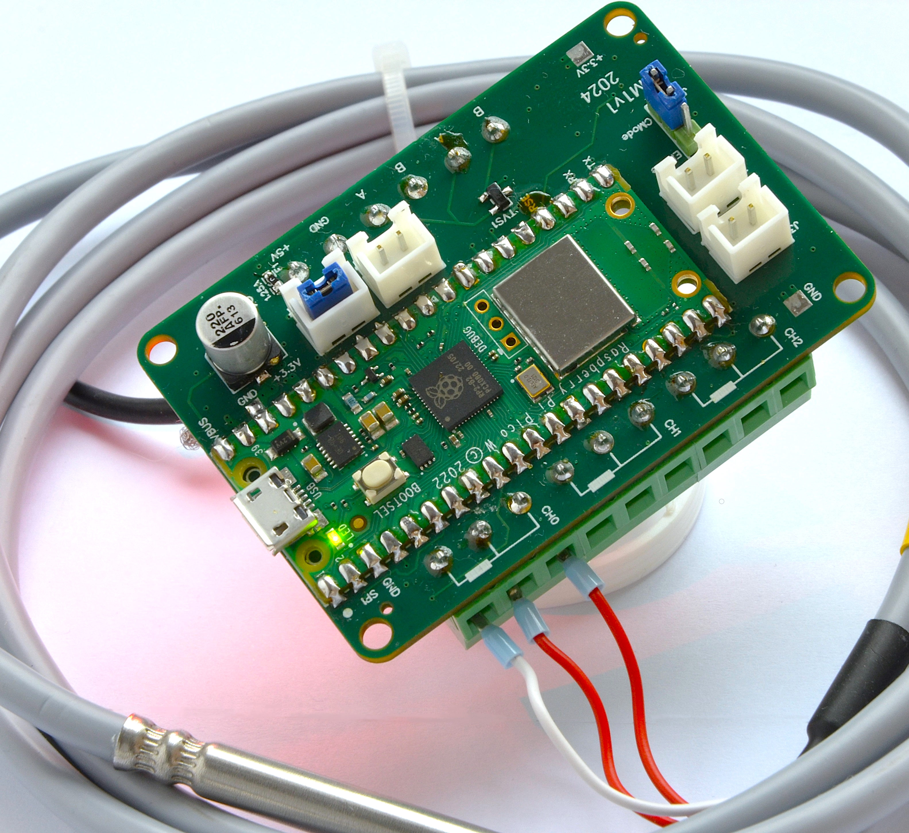
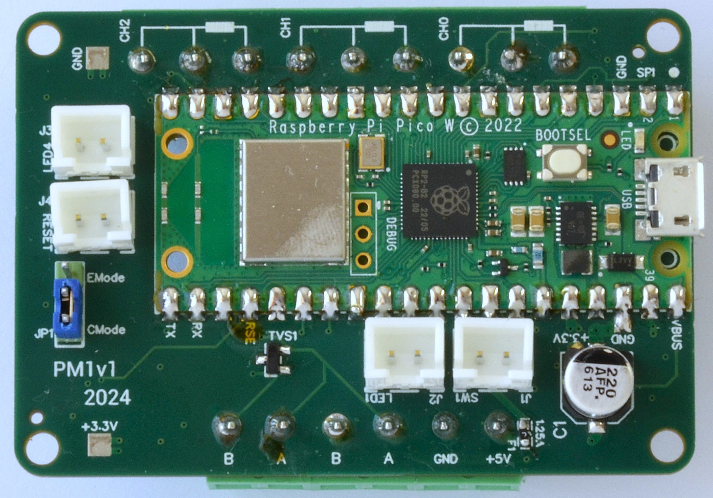
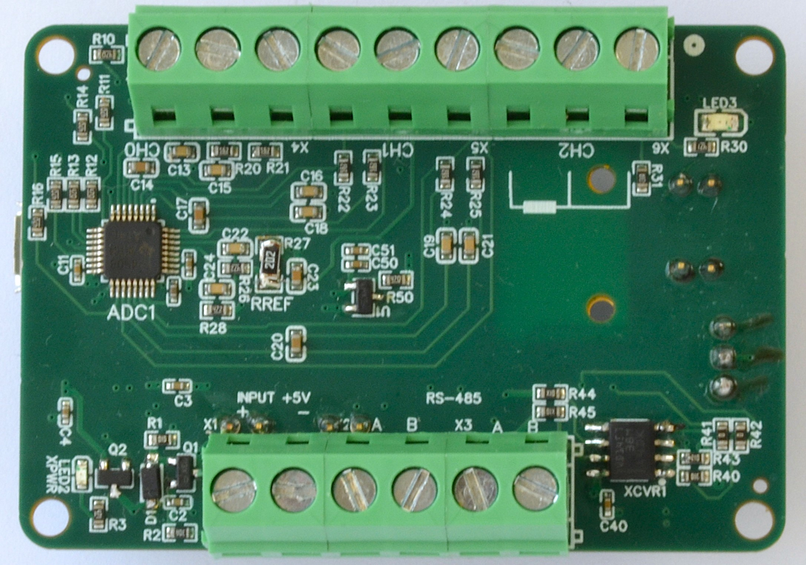
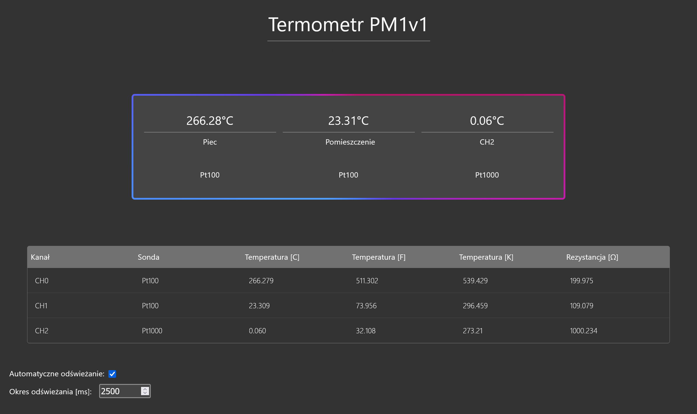

# PM1

Customizable 3-channel Pt100/Pt1000 thermometer on a dedicated PCB equipped with many communication interfaces. It can measure temperature with high accuracy (±0.1°C or possibly better). Additionally, it supports USB, Modbus RTU and Wi-Fi (web interface and API). Software is written in a highly modular fashion to facitilate future changes or even new models. Device was designed to be easy to use for both humans and computers as it's intended for theoretical commercial use.

### Images

